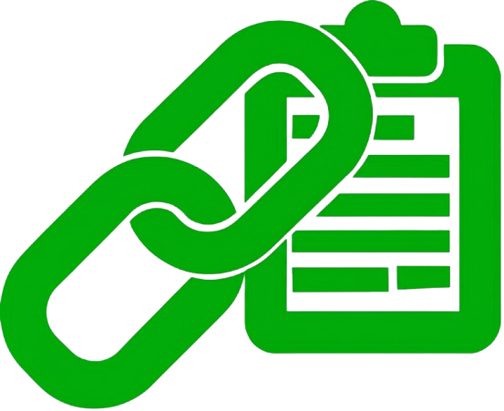

# Copy Link Text - Chrome Extension

## 🔒 Privacy Policy

_Last updated: July 15, 2025_

We respect your privacy. The **Copy Link Text** Chrome extension is designed to run locally on your device without collecting or transmitting any personal data.

---

## ✅ What the Extension Does

This extension adds a simple right-click menu option — **"Copy Link Text"** — that:

- Copies the **visible text** of the clicked hyperlink to your clipboard.
- Shows a ✅ confirmation toast on the page.
- Does not store, transmit, or track anything.

---

## 🔐 Permissions Explained

We request the following Chrome permissions:

- `contextMenus`: To show the right-click menu on links.
- `scripting`: To inject a script to detect and copy the link text.
- `clipboardWrite`: To copy content to the clipboard.
- `host_permissions`: `<all_urls>` to support functionality across all websites.

These permissions are used **solely for extension functionality** and **never** for data collection.

---

## 🚫 No Data Collection

This extension:

- Does **not** collect or store personal data.
- Does **not** track user behavior or browsing history.
- Does **not** use cookies or local storage.
- Does **not** connect to any external APIs or servers.

Everything happens securely and privately **on your device only**.

---

## 📧 Contact

For support, feedback, or privacy-related inquiries:

- [LinkedIn](https://linkedin.com/in/muneebulhassan-ml)
- [GitHub](https://github.com/MuneebUH)

---

© 2025 [Your Name or Team]. All rights reserved.
